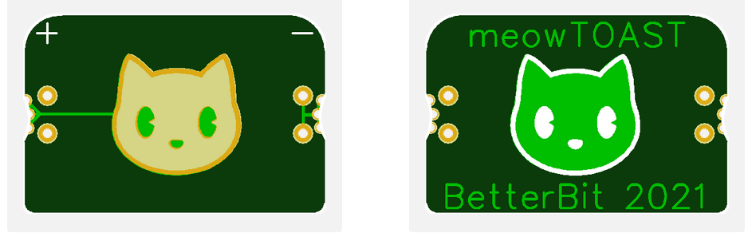

# meowTOAST

1. Buy [this CR2032 holder from Mouser](https://www.mouser.com/ProductDetail/Linx-Technologies/BAT-HLD-001-THM?qs=Z0V/pEl%252BOGcluj3h2QTrDw==)
2. Solder the CR2032 holder to the [meowTOAST PCB](https://oshwlab.com/stephenarsenault/halfstack).
3. Make sure the ` m e t a l l i c` kitty side of the PCB is facing the CR2032 holder.
4. Place the assembled meowTOAST in your 1/2AA battery holder.

`meowToast is a product of the Open Retro SCSI skunksworks team.`

`Special thanks to GeekyBit and Zone66x.`

All Rights Not Reserved 2021

# License
meowTOAST is ridiculous and isn't held under any licenses.
